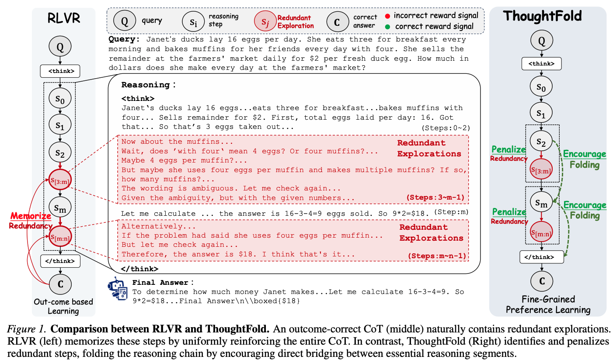
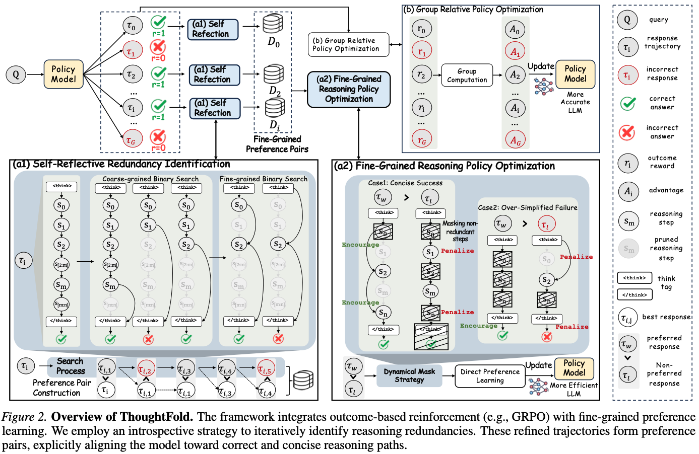

<h1 align="center">ThoughtFold: Folding Reasoning Chains via Introspective Preference Learning</h1>

<p align="center">
<em>Folding redundant reasoning chains via introspective preference learning for efficient LRM inference.</em>
(<strong>🎉🎉🎉 Accepted by ICML 2026</strong>)
</p>

<p align="center">
  <a href="https://arxiv.org/pdf/2606.03503"></a>
  <a href="https://huggingface.co/papers/2606.03503"></a>
  <a href="./LICENSE"></a>
</p>

> 🚧 **Work in Progress:** This repository is currently being organized, and an enhanced version of ThoughtFold is under active development. Discussions and feedback are very welcome.
---

## 🚀 Motivation

Large Reasoning Models (LRMs) suffer from **overthinking** — since CoTs naturally contain trial and errors, mainstream RLVR approaches choose outcome-correct CoT trajectories for memorization, causing the redundant explorations in long CoTs to be inevitably reinforced.

> RLVR (left) memorizes these steps by uniformly reinforcing the entire CoT. In contrast, **ThoughtFold** (right) identifies and penalizes redundant steps, folding the reasoning chain by encouraging direct bridging between essential reasoning segments.

<p align="center"></p>

---

## 💡 Key Idea

**ThoughtFold** integrates outcome-based RLVR with fine-grained preference learning for efficient reasoning. Unlike vanilla RLVR strategies that uniformly reinforce all steps in a correct trajectory, our method performs fine-grained preference learning by identifying and explicitly fold redundant thoughts.

Specifically, ThoughtFold employs an introspective strategy for redundancy identification:

- **Outcome-Correct Trajectory → Spectrum of Sub-trajectories:** Starting with an outcome-correct trajectory, we iteratively remove specific reasoning segments to verify if the model can still derive the correct answer.
- **Concise Successes vs. Over-simplified Failures:** This yields a spectrum distinguishing between concise successes (redundancy successfully removed) and over-simplified failures (essential logic broken).
- **Masked Preference Optimization:** Based on this spectrum, ThoughtFold applies a mask-based fine-grained preference optimization to explicitly penalize redundant explorations and encourage the model to directly bridge essential logical steps.

---

## 🧩 Method

<p align="center"></p>

ThoughtFold performs two-phase introspective pruning within the RLVR training loop:

**Phase 1 — Tail Truncation (Binary Search on CoT Length)**

For each correct sample, binary search on CoT length to find the shortest prefix that still produces correct answers above a confidence threshold.

**Phase 2 — Internal Folding (Attention-Guided Sentence Pruning)**

Use attention scores to compute per-sentence importance, then binary search on the top-k retention ratio to identify and remove low-importance reasoning sentences.

**DPO Pair Construction:**

Each pruning iteration produces a masked DPO pair:
- ✅ **Concise Success:** shorter correct response = chosen, longer response = rejected. Loss applied only to the pruned (redundant) region.
- ❌ **Over-simplified Failure:** over-pruned incorrect response = rejected, last correct response = chosen. Loss targets the answer portion to encourage bridging.

---

## 📊 Results

ThoughtFold significantly enhances reasoning efficiency. It reduces the average token consumption of DeepSeek-R1-Distill-Qwen-7B by approximately **56%** while maintaining state-of-the-art accuracy, surpassing recent efficient reasoning works.

---

## 📦 Project Structure

```
thoughtfold/
├── __init__.py
├── main.py                          # Standard GRPO training entry
├── thoughtfold_train.py             # ThoughtFold entry (DPO + Binary Search)
└── binsearch/
    ├── __init__.py
    ├── binary_search_environment.py # Core: two-phase introspective pruning
    ├── binary_search_trainer.py     # DPO Trainer with masked label construction
    └── utils.py
```

---

## ⚙️ Usage

### Configuration

Key parameters in config file:

```python
enable_binary_search = True
binary_search_config = {
    'repeat': 4,                        # Validation sampling repeat
    'threshold': 0.7,                   # Correctness threshold for acceptance
    'max_iterations': 5,                # Max binary search iterations (Phase 1)
    'min_cot_length': 300,              # Minimum CoT length to attempt pruning
    'enable_fine_grained_pruning': True, # Enable Phase 2
    'topk_search_min': 0.1,            # Min retention ratio (Phase 2)
    'topk_search_max': 0.9,            # Max retention ratio (Phase 2)
    'topk_search_iterations': 5,        # Max iterations (Phase 2)
    'pruning_repeat': 4,               # Validation repeat (Phase 2)
}
```


---

## 📌 Citation

```bibtex
@misc{liu2026thoughtfoldfoldingreasoningchains,
      title={ThoughtFold: Folding Reasoning Chains via Introspective Preference Learning}, 
      author={Ziyan Liu and Xueda Shen and Yuzhe Gu and Songyang Gao and Kuikun Liu and Guangran Cheng and Chengqi Lyu and Dahua Lin and Wenwei Zhang and Kai Chen},
      year={2026},
      eprint={2606.03503},
      archivePrefix={arXiv},
      primaryClass={cs.AI},
      url={https://arxiv.org/abs/2606.03503}, 
}
```
